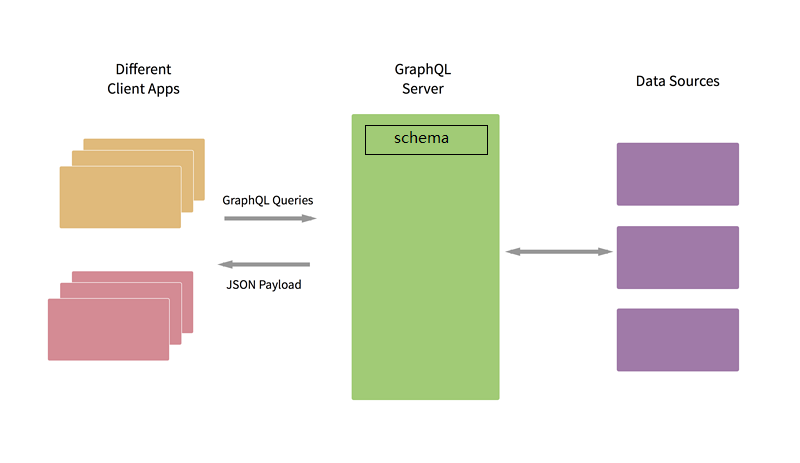
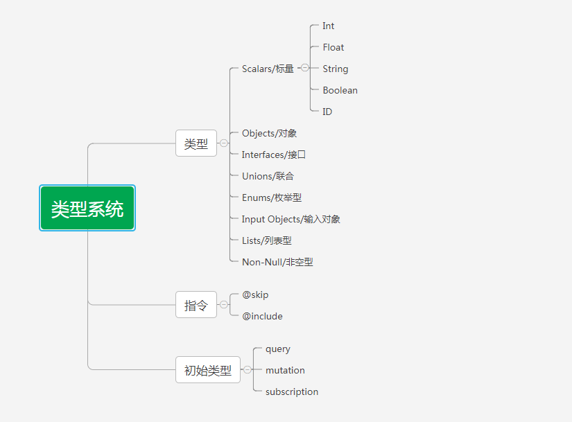

# GraphQL

## 什么是 GraphQL

GraphQL 是由 Facebook 创造的针对API的一种查询语言。这里查询语言所指的并不是常规意义上的类似 sql 语句的查询语言，
而是一种用于前后端数据查询方式的<a href='http://spec.graphql.cn/' target='_blank'>规范</a>。

## GraphQL 的设计
1. 类型系统 Type System
2. 查询语言 Query Language
3. 内省 Introspection
4. 验证 Validation
5. 执行 Execution

<h4>1. 类型系统 Type System</h4>

GraphQL的类型系统用于描述服务器的能力以及判断一个查询是否有效。类系统也描述了查询参数的输入类型，用于运行时检查有效性。

GraphQL服务器的能力是同schema来描述，schema使用其支持的类型和指令来定义。

每一个 GraphQL 服务都会定义一套类型，用以描述你可能从那个服务查询到的数据。每当查询到来，服务器就会根据 schema 验证并执行查询。
* Scalars: 标量类型

GraphQL中一个标量代表一个原始值，GraphQL的响应采用的是树形层级结构，而它的叶子节点都是标量。
标量类型也可以和javaScript中的类型一一对应。
    * Int 整数型标量类型，表示一个32位有符号的无小数部分的数值,对应js的Number类型。
    * Float 浮点型标量类型，表示一个有符号的双精度小数，对应js的Float类型。
    * String 字符串型标量类型，文本数据，对应js的String。
    * Boolean 布尔型标量类型，对应js的Boolean。
    * ID ID型标量表示一个唯一标识符，通常由于重取一个对象或者作为缓存的键，类似js的Symbol类型。
* Object： 对象

GraphQL查询是层级式的可组装的，以树的形式描述了信息。其中标量类型描述了层级查询中叶子节点的值，对象则描述了中间层。
GraphQL对象是一个有序映射集，其中查询字段名（或者别名）作为键，字段产生的一个特定类型的结果作为值。
```
type Author{
  id: Int
  firstName: String
  lastName: String
}
```
* Interfaces: 接口

GraphQL接口表示一个具名字段列表以及其参数，GraphQL对象可以实现接口，并保证包含接口中的字段。
```
interface AuthorInterface{
  firstName: String
}
type Author implements AuthorInterface{
  id: Int
  firstName: String
  lastName: String
}
```
* Unions: 联合

GraphQL联合表示一个对象的类型是对象类型列表中之一。
```
union animal = Gog | Cat
type Gog {
  name: String
  age: Int
}
type Cat {
  name: String,
  color: String
}
```
* Enums: 枚举型

GraphQL枚举型是基于标量类型的变体，其表示可能值的一个有限集。
```
enums Catcolors{
  ORANGE
  BLACK
  WHITE
}
```
* input Objects: 输入对象

`Input Object`定义了输入字段的一个集合，字段上可能会定义参数，客户端将参数合在查询中传输，从而改变字段的行为。
这些输入可能是字符串型或者枚举型，但是有时候需要比这个更复杂的类型结构。
```
input addAuthorInput {
  firstName: String!
  lastName: String!
}
```
* Lists: 列表型

GraphQL列表型，表示一个特殊的集合类型。类似：authors: [Author], 表示authors字段的结果是一个包含Author类型中字段子集的一个集合
```
type Author{
  id: Int
  firstName: String
  lastName: String
}
```
* Non-Null: 非空型

非空类型使用一个感叹号来表示
```
type Author{
  id: Int!
  firstName: String
  lastName: String
}
```
<h4>2. 查询语言 Query Language</h4>

类型系统对应前面提到的 Schema，是对服务器端数据的描述，而查询语言则解耦了前端开发者与后端接口的依赖。
前端开发者利用查询语言可以自由地组织和定制系统能够提供的业务数据。

GraphQL查询文档描述了GraphQL服务收到的完整文件或者请求字符串。
一个文档可以包含多个操作（Operations）和片段(Fragments)的定义。
一个查询文档只有包含操作时，服务器才能执行。
但是无操作的文档也能被解析和验证，以让客户端提供单个跨文档请求。

<h5>Operations 操作</h5>

操作的类型有三种：`query`,`mutation`,`subscription`。
* query/查询 - 只是读取操作
* mutation/更改 - 先写入再获取
* subscription/订阅 - 一个长连接请求，根据源时间获取数据

每一个操作都以一个可选操作名和选择集合表示
```
query {
  author(id: 1) {
    id
    firstName
  }
}
```
上面的例子中query为可选操作名，
选择集表示这个操作它所需要的信息的集合，然后就会精确地得到他所要的信息，没有一点多余，避免了数据的多取或少取。
参数id值为1。
id, firstName表示要获取的结果字段，`fn:firstName`表示firstName的别名是fn
```
{
  author(id: 1) {
    id
    fn:firstName
  }
}
```

<h5>Fragments 片段</h5>

片段是GraphQL组合拼装的基本单元，通过片段可以重用重读的字段选择，减少了文档中的重复文本。

```
{
  author(id: 1) {
    id
    firstName
    lastName
  }
  other:author(id: 2) {
    id
    firstName
    lastName
  }
}

fragment authorFragment on Author{
  id
  firstName
  lastName
}
{
  author(id: 1) {
    ...authorFragment
  }
  other:author(id: 2) {
    ...authorFragment
  }
}

{
  author(id: 1) {
    ... on Author{
       id
       firstName
    }
  }
}
```

<h5>Directives 指令</h5>

有时候，你需要改变GraphQL的执行行为，而参数并不满足要求，譬如条件性的包含或者跳过一个字段。
指令通过向执行器描述附加信息来完成这种需求。

* @skip 表示当if条件满足时跳过查询

```
{
  author(id: 1) @skip(if: false) {
     id
     firstName
  }
}
```

* @include 表示当if条件满足时才查询，否则忽略

```
{
  author(id: 1) @include(if: false) {
     id
     firstName
  }
}
```

<h4>3. 内省 Introspection</h4>

同过内省系统我们可以知道服务端的GraphQL Schema支持哪些查询，哪些类型可用。
```
{
  __schema{
    types {
      name
      description
    }
  }
}
```
通过__schema可以知道schema有哪些类型，包括自己定义的类型，内建标量，内省系统的类型

```
{
  __type(name: "Author"){
    name
    kind
    fields{
      name
      type{
        name
        kind
      }
    }
  }
}
```
通过__type(name: typeName!)可以知道schema中定义的类型的信息

<h4>4. 验证 Validation</h4>

通过使用类型系统，你可以预判一个查询是否有效。这让服务器和客户端可以在无效查询创建时就有效地通知开发者，而不用依赖运行时检查。
这部分依赖于它的验证器的算法。由于验证规则太多了，就不列举了。详情可看<a href='http://spec.graphql.cn/#sec-Validation-' target='_blank'>规范 验证</a>，
GraphQL 验证器实现<a href='https://github.com/graphql/graphql-js/tree/master/src/validation' target='_blank'>代码</a>。

<h4>5. 执行 Execution</h4>

一个 GraphQL 查询在被验证后，GraphQL 服务器会将之执行，并返回与请求的结构相对应的结果，该结果通常会是 JSON 的格式。

## 为什么使用GraphQL

要说为什么要使用它，就要从它有什么优点，能给我们的开发带来什么变化来说了。

在使用它时，最常见被选用的客户端到服务器协议是HTTP，而HTTP通常与REST相关联，REST 使用“资源”作为其核心概念，且讲究一个 RESTful 接口仅操作单一资源。
因此在你使用 RESTful 时，当某些接口不满足情况时，我们会新增接口，或者升级接口，这样就导致产生出大量的接口。所以客户端的请求最终会多次往返服务器，以收集所有需要的数据。

GraphQL 是单一入口，一般配置在 [host]/graphql/，所有的资源都从该入口通过 graphql 的语句获取或修改。
使用GraphQL,我们就可以将这种多个请求的复杂度移交到服务器端，通过GraphQL层处理它。客户端向 GraphQL 层发起单个请求，并获得一个完全符合客户端需求的响应。

例如： /api/v1/getStaffList 获取员工列表 、/api/v1/ID/getStaffInfo 获取员工的详细信息
当需要在列表中展示一部分员工详情信息时，我们就需要调用这两个接口。而用了GraphQL我们需要在GraphQL服务定义一系列客户端需要的类型和属性, 还有对应属性的处理函数。
```
type Query{
    staffs: [Staff]
}
type Staff {
    id: ID
    name: String
    detailInfo: StaffDetail
}
type StaffDetail {
    age: Int
    sex: String
}
```
客户端至于要将下面的查询文档发送给GraphQL服务就行了

```
query {
    staffs: {
        id,
        name,
        detailInfo {
            age
        }
    }
}
```

对应的响应：
```
{
 staffs: [
    {
        id: 1,
        name: '张三',
        detailInfo: {
            age: 18
        }
    },
    {
        id: 2,
        name: '李四',
        detailInfo: {
            age: 18
        }
    },
 ]
}
```
由上简单例子可知GraphQL的三大特性：
  1. 它是<b>声明式</b>的。查询的结果格式由请求方（即客户端）决定而非响应方（即服务器端）决定，也就是说，一个 GraphQL 查询结果的返回是同客户端请求时的结构一样的，不多不少，不增不减。
  2. 它是<b>可组合</b>的。一个 GraphQL 的查询结构是一个有层次的字段集，它可以任意层次地进行嵌套或组合，也就是说它可以通过对字段进行组合、嵌套来满足需求。
  3. 它是<b>强类型</b>的。强类型保证，只有当一个 GraphQL 查询满足所设定的查询类型，那么查询的结果才会被执行

回到前面讲的REST的问题，Graphql很好的解决了REST的一些缺点。当需求或数据发生变化时，客户端可以根据需求来改变查询的结构，
只要查询结构满足之前的定义，服务器端代码甚至不需要做任何的修改；即使不满足，也只需修改服务器端的查询结构，而不必额外添加新的接口来满足需求。


看图说话，总结GraphQL的整个过程，以及核心设计：
<h5>类型系统</h5>
GraphQL的类型系统用于描述服务器的能力以及判断一个查询是否有效。类型系统也描述了查询参数的输入类型，用于运行时检查有效性。
GraphQL服务器的能力是同schema来描述，schema使用其支持的类型和指令来定义。<a href='http://spec.graphql.cn/#sec-Type-System-' target='_blank'>了解更多</a>

```
type Author {
  id: Int
  firstName: String
  lastName: String
  posts: [Post],
  authorDetail: AuthorDetail,
}
type Post {
  id: Int
  title: String
  text: String
  views: Int
  author: Author
}
type AuthorDetail {
  age: Int
  # author: [Author]
}
type Query {
  author(id: Int!): Author
  allAuthor(limit: Int, offset: Int): [Author]
}
type Mutation{
  updateAuthor(id: Int!, firstName: String!): Author
  addAuthor(input: addAuthorInput!): AuthorId
  deleteAuthor(id: Int!): [Author]
}
type AuthorId {
  id: Int
}
input addAuthorInput {
  firstName: String!
  lastName: String!
}
```
这样就定义好了一个GraphQL Schema, 接下来就是如何查询了

<h5>查询语法</h5>
除了query，还有mutation，subscription,这里的查询语法是一个字符串，它描述了客户端所需要的数据结构，没有冗余数据.
```
query author{
  allAuthor{
    id,
    lastName
    authorDetail{
      age @include(if: false),
    }
  }
}
```
返回结果：
```
{
  "data": {
    "allAuthor": [
      {
        "id": 1,
        "lastName": "World",
        "authorDetail": {}
      },
      {
        "id": 2,
        "lastName": "World1",
        "authorDetail": {}
      }
    ]
  }
}
```
<h5>验证</h5>
GraphQL不仅会检测一个请求是否句法上正确，还会其在给定GraphQL schema上下文内无歧义无错误。

一个无效请求依然是技术上可执行的，也能通过执行章节的步骤产生稳定的结果，但是相对于这个有验证错误的请求，其结果可能是有歧义的、意外不可预知的，所以对于无效请求，不应该予以执行。

典型的验证会在请求执行前的上下文中执行，但是如果给定请求之前已经通过验证，那么GraphQL服务在执行这个请求前可能不会显式的验证它，譬如一个请求在开发期已经通过验证，并假设他后面不会改变，或者服务器层验证了一个请求，记住了它的验证结果以避免后续再次验证同样的请求。因此任何客户端或者开发期工具，都应该汇报验证错误，并阻止构建或者执行当时已知错误的请求。
<a href='http://spec.graphql.cn/#sec-Validation-' target='_blank'>了解更多</a>
<h5>内省</h5>
一个GraphQL服务器支持基于它的Schema来支持内省，这个Schema可以通过GraphQL自身来查询，创建了一个强大的工具构建平台。
<a href='http://spec.graphql.cn/#sec-Introspection-' target='_blank'>了解更多</a>
```
{
  __type(name: "Author"){
    name,
    fields{
      name,
      type{
        name
      }
    }
    inputFields {
      description
      defaultValue
    }
  }
}
```
结果:
```
{
  "data": {
    "__type": {
      "name": "Author",
      "fields": [
        {
          "name": "id",
          "type": {
            "name": "Int"
          }
        },
        {
          "name": "firstName",
          "type": {
            "name": "String"
          }
        },
        {
          "name": "lastName",
          "type": {
            "name": "String"
          }
        },
        {
          "name": "posts",
          "type": {
            "name": null
          }
        },
        {
          "name": "authorDetail",
          "type": {
            "name": "AuthorDetail"
          }
        }
      ],
      "inputFields": null
    }
  }
}
```
## 如何使用GraphQL
GraphQL 是一种客户端同服务端之间数据交互的概念，具有强大、灵活、易扩展等的特点。既然，它是一种概念，那么，不同的语言就可以有各种不同的实现方式。
<a href='http://graphql.cn/code/' target='_blank'>这里</a>列举了GraphQL所支持的所有语言以及相关实现。

## GraphQL的问题
1. 由于它支持各种嵌套，所以一旦暴露了入口端点就很容易被恶意攻击。
2. 容易造成n+1的查询， <a href='https://github.com/facebook/dataloader' target='_blank'>dataloader</a>可以解决这个问题。

## 参考
<div><a href='http://spec.graphql.cn/' target='_blank'>GraphQL规范</a></div>
<div><a href='http://graphql.cn' target='_blank'>GraphQL中文官网</a></div>